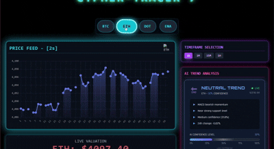

# AI Crypto Trend Prediction System

  <!-- Add your GIF in the repo root as demo.gif -->

**Real-time cryptocurrency trend prediction and analytics dashboard** using AI-driven ensemble models.

---

## 🚀 Features

- Streams **live cryptocurrency prices** (BTC, ETH, DOT, ENA) via Binance API.  
- Real-time **trend predictions** with confidence levels.  
- Ensemble AI model using **technical indicators**: RSI, MACD, Bollinger Bands.  
- WebSocket integration for **instant updates on a React dashboard**.  
- Clean architecture for **data processing, async streaming, and analytics**.

---

## 🛠 Tech Stack

- **Frontend:** React, Tailwind CSS  
- **Backend:** Python, FastAPI, WebSockets  
- **Data Processing:** NumPy, Pandas  
- **API:** Binance API  
- **Visualization:** React Charts / Dashboard components  

---

## 🎬 Demo


> The dashboard shows live price updates and trend predictions with confidence scores.

---

## ⚡ Getting Started

1. **Clone the repository**  

```bash
git clone https://github.com/Maha-ali1233/crypto-trend-app.git
cd crypto-trend-app
